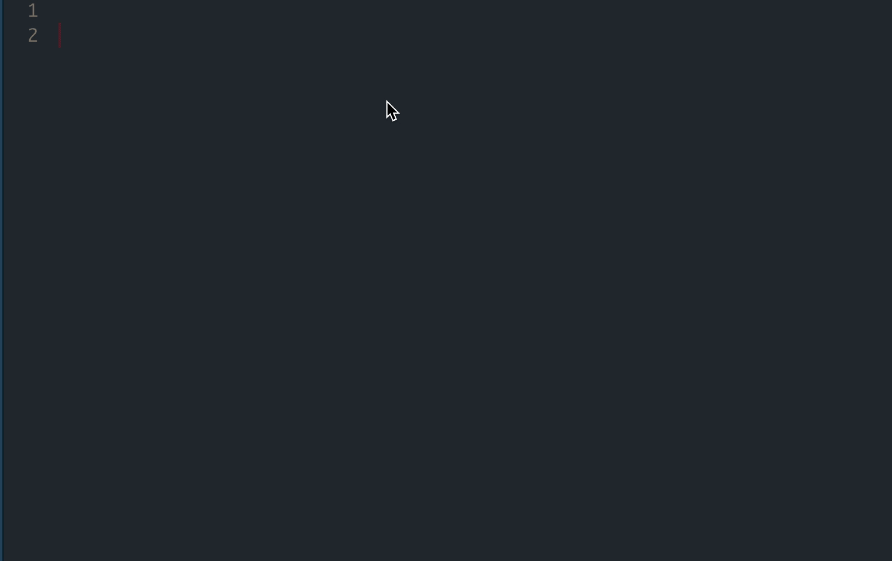

<!-- README.md is generated from README.Rmd. Please edit that file -->

# aocfuns

<!-- badges: start -->
<!-- badges: end -->

The goal of aocfuns is to provide functions that sub in function
definitions for functions I wish I had when doing [Advent of
Code](https://adventofcode.com/)

## Installation

You can install the development version of aocfuns like so:

``` r
remotes::install_github("EmilHvitfeldt/aocfuns")
```

## Example

Simply run the code as `aocfuns::function()` and it will modify the
document for you


